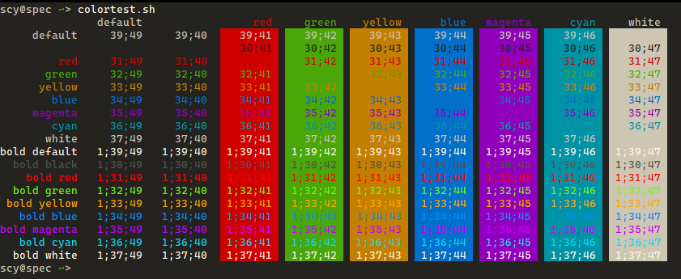

# _One Dark Pro_ Everywhere

This project will, based on the [Visual Studio Code](https://code.visualstudio.com/) color scheme [_One Dark Pro_](https://binaryify.github.io/OneDark-Pro/), create a full 16 color [ANSI palette](https://en.wikipedia.org/wiki/ANSI_escape_code#Colors) for use in terminal emulators, other editors etc.

## Screenshot

## Design Goals

1. Create any additional colors needed programmatically, based on the original _One Dark Pro_ colors.
2. Allow creating configuration files for all the terminal emulators the author ([@scy](https://github.com/scy)) is using.
3. If there are things that suck (according to me) in the original theme, try to fix them.

## Status

I'm using it on several of my machines.
I'm not yet perfectly happy with it, expect some tuning.

Also, this is pretty much a personal project, I'm not sure whether I want to accept issues, pull requests etc.
Try it on your own risk. 😛
Maybe I'll even abandon this project again after a week.

## Supported Terminals/Editors

* [Termux](https://termux.com/)
* Visual Studio Code (via the original [_One Dark Pro_ extension](https://marketplace.visualstudio.com/items?itemName=zhuangtongfa.Material-theme))
* Windows Console (`cmd.exe`)
* xterm (via `.Xresources` file)

Planned:

* Linux text mode
* [Windows Terminal](https://github.com/Microsoft/Terminal)

## Building

Make sure to check out the `onedark-pro` submodule when cloning this repo.
Then, make sure the [colormath](https://python-colormath.readthedocs.io/) library is available.
I'm providing [Pipenv](https://docs.pipenv.org/) files to get it.

Fire up `convert.py`.
It will create several configuration files in the `out` directory and even create that if it doesn't exist because awesome UX.

You can also access the conversion logic from your own code by `import`ing `convert`.
Read the code for more information.

## Differences to Previous Projects

This project supersedes the [_Unexciting_](https://github.com/scy/unexciting) theme only two days after its initial creation.
This is because after creating _Unexciting_, I found out that creating a VS Code theme is more work that I want to invest.
Therefore, I had to choose an existing theme and create the terminal palettes based on it.

Other differences:

* _Unexciting_ explicitly listed good readability as a requirement, with “blue on black” and “gray on color” as explicit examples of what was supposed to look good.
  Now, _One Dark Pro's_ blue is bright enough to look good on black, but the default text color (which is color 7 or “foreground” in this theme) doesn't look good on a colored background.
  To be honest, other colors don't look good on colored backgrounds either (think WeeChat status bar with highlighted channels).
  My current plan is to configure the CLI software to use better color combinations instead of changing the terminal's theme colors, but I'm not sure yet.
* _Unexciting_ also explicitly listed ANSI color compatibility as a requirement.
  This is basically implemented implicitly by choosing matching colors from _One Dark Pro's_ palette.

## License

MIT, see [LICENSE.txt](LICENSE.txt).
